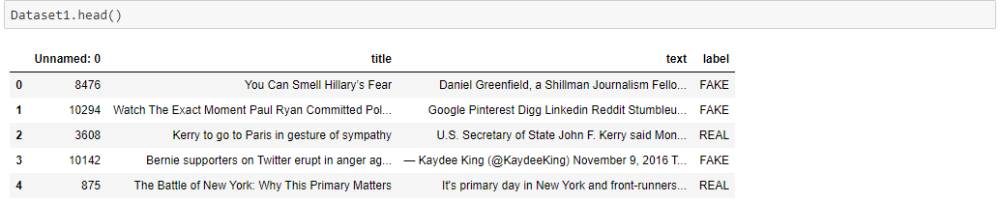
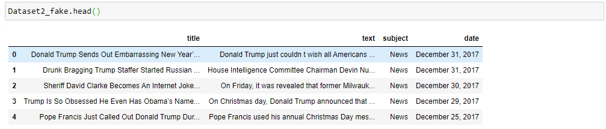
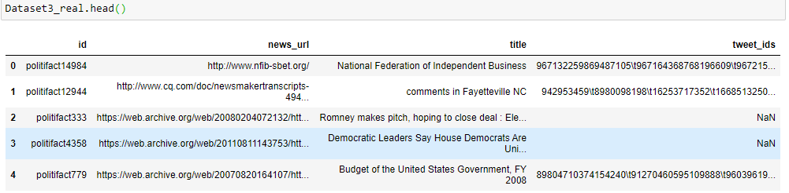
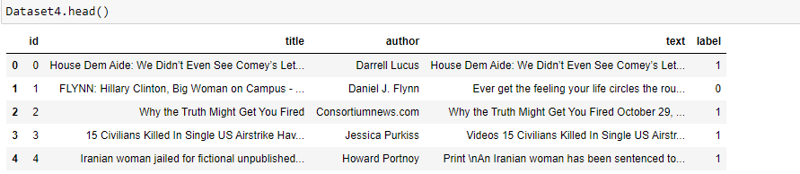
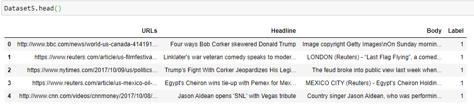
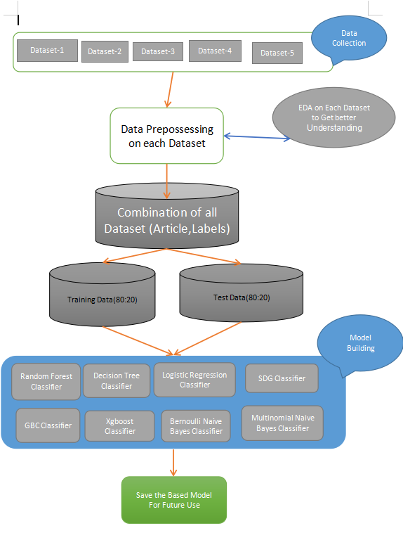
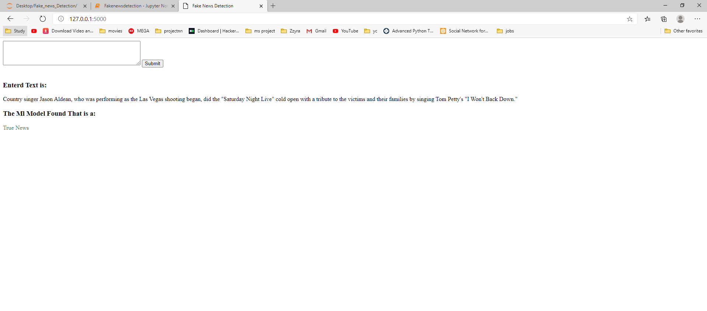
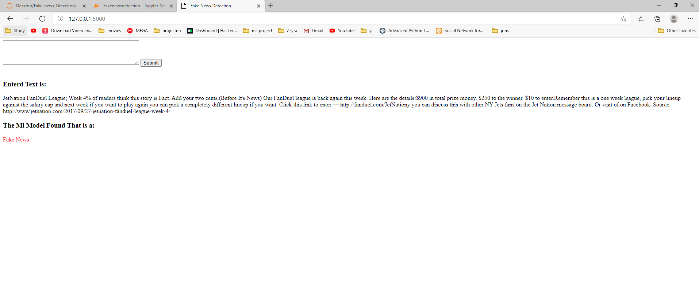
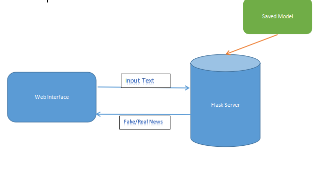

# Fake News Detection
## Overview
---
The term fake news has become a buzz word these days.There was a time when if anyone needed any news, he or she would wait for the next-day newspaper. However, with the growth of online newspapers who update news almost instantly, people have found a better and faster way to be informed of the matter of his/her interest. Nowadays social-networking systems, online news portals, and other online media have become the main sources of news through which interesting and breaking news are shared at a rapid pace. However, many news portals serve special interest by feeding with distorted, partially correct, and sometimes imaginary news that is likely to attract the attention of a target group of people. Fake news has become a major concern for being destructive sometimes spreading confusion and deliberate disinformation among the people.

The Aim of this project is to build a model which uses Natural Language Processing to detect Fake news based on the text content of the Article. This model is deployed into a web interface using python_Flask.

## Prerequisites
---
### Things you need to install
1. Python 3.9
- Your machine should have python 3.9 installed on it. If not, you can refer to this url https://www.python.org/downloads/ to download python. Once you have python downloaded and installed, you will need to setup PATH variable.
2. You will also need to download and install the required packages after installing python
- sklearn (scikit-learn)
- numpy
- Pandas
- matplotlib
- seaborn
- NLTK
- Joblib
- flask
3. To install the Packages
  ```
  pip install -r requirments.txt
  
  ```

4. Or else use can download anaconda and use its anaconda prompt to run the commands. To install anaconda check this url https://www.anaconda.com/download/. most the Packages are preinstalled in the anaconda environment
## Dataset
---
All of the Dataset that used in this project are availabe in public Domain. Most of the Dataset are collected from Kaggle (https://www.kaggle.com/) different datsets contain different column and different information like title,text,subject,news_url,author.

- sample view of Dataset1
  
- sample view of Dataset2
  
- sample view of Dataset3
  
- sample view of Dataset4
  
- sample view of Dataset5
  
For building this model, we only need text and Label,The final dataset will contain only 2 columns i.e, 'Article' and 'Label.

- For text we will create a news column named 'Article' which is the Combination Header and text
- In the Label column
  - 1 represents true
  - 0 represents fake

## Data preprocessing
---
1. Remove all unwanted columns.
2. Remove All Missing Values Records.
3. Removing all the extra information like brackets, any kind of puctuations - commas, apostrophes, quotes, question marks from Text.
4. Remove all the numeric text, urls from Text.

## ML model Traning and Building
---
Here I have build all the classifiers for predicting the fake news detection. The extracted features are fed into different classifiers. I have used Logistic Regression, XGboost, DecisionTree, Naive Bayes classifiers. Each of the extracted features were used in all of the classifiers. After fitting each of the model in various classifiers, I have compared the accuracy score and checked the confusion matrix.

**Accuracy Score**

.png)

The highest accuracy score I got is 87.04 but as model was trained with 61,000+ recored it will perform well. So, finally selected and best performing classifier was Logistic Regression which was then saved on disk with name model.plk . Once you clone this repository, this model will be copied to your machine and will be used for prediction. It takes a news article as input from user then displays to user whether it is Real or Fake. model.plk is used to deploy the model using Flask.

**Below is the Process Flow of the Model Building:**


## ML model Deployment
For Deploying we need to create a sample web interface which will get the text from the user and then send it to the flask server.In the flask server we will use the saved model model.plk to predict the news is real or fake and then return the result to the user through web interface.  
Example 1 

Example 2 


**Below is the Process Flow of the Model Deployment:**


## Next steps
--- 

### Steps to Run this software
---
1. The first step would be to clone this repository in a folder in your local machine. To do that you need to run following command in your command prompt or in git bash.
```
$ git clone  https://github.com/Vaishnavi-Verma-21/Fake_news_Detection.git

```
2. This will copy all the data source file, program files and model into your machine.

3. Then open the app.py file which is inside the 'Model deployment using Flask' folder/directory.

4. After you change the folder/directory link run app.py by using IDLE(defult python Editer) or open the command prompt in the same directory and run the folloing code
```
$ python app.py

```
5. Then in Your web browser type this link http:localhost:5000/

6. Then Enter the Text in Text box you want to check and click on submit.

7. Program will take user input text and will be used by model to classify in one of categories of "True" and "False".

8. Then the Flask server will return the result to your browser.
